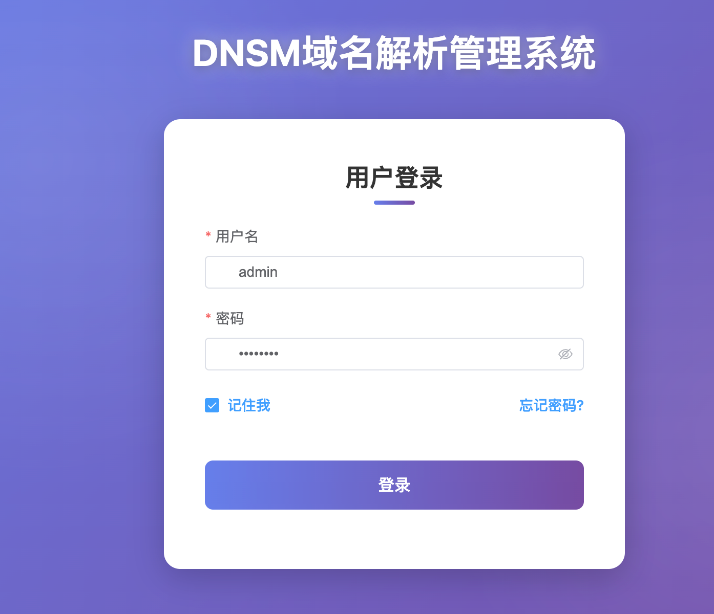
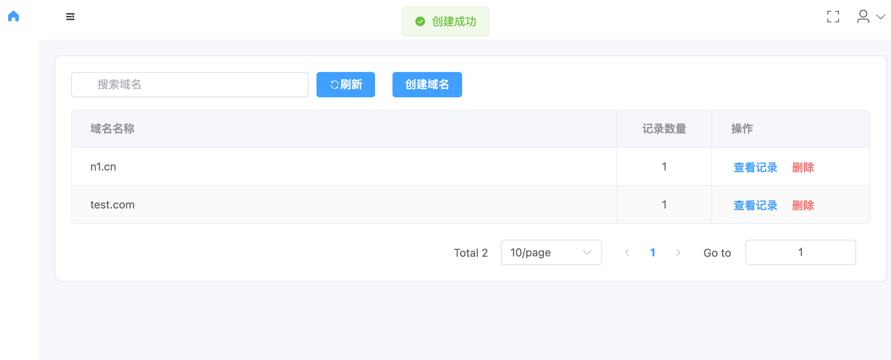
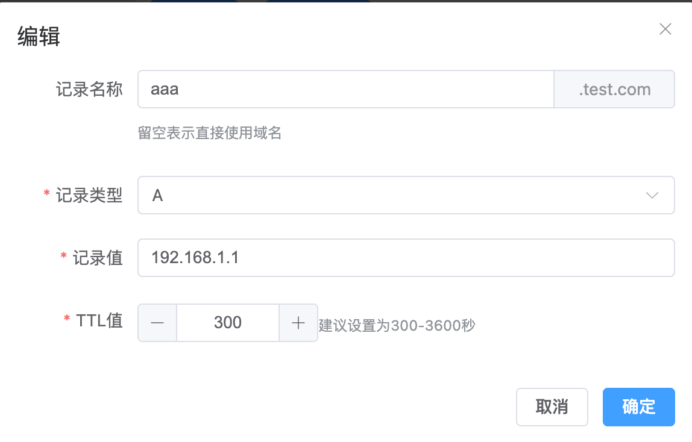

# dnsm-web

## 项目介绍
dnsm-web是dnsm的前端，用于管理域名增删改查。


## 编译项目

### 正式环境
```bash
# 克隆项目
git clone git@github.com:hqiaozhi/dnsm-web.git  
cd dnsm-web
npm install
npm run build
```

### 开发环境
准备环境变量文件，指定后端接口地址：
```bash
vim .env
VITE_APP_BASE_API = http://localhost:8080
```
```bash
# 克隆项目
git clone git@github.com:hqiaozhi/dnsm-web.git  
cd dnsm-web
npm install
npm run dev
```


## 界面展示





项目后端地址：https://github.com/hqiaozhi/dnsm